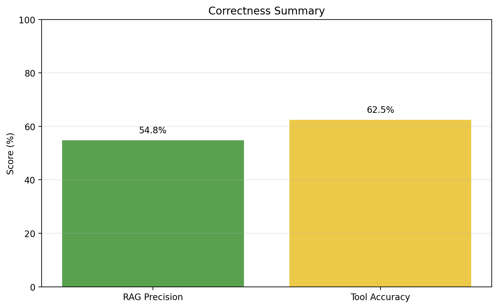
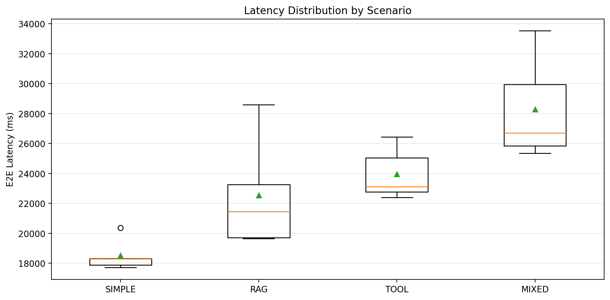
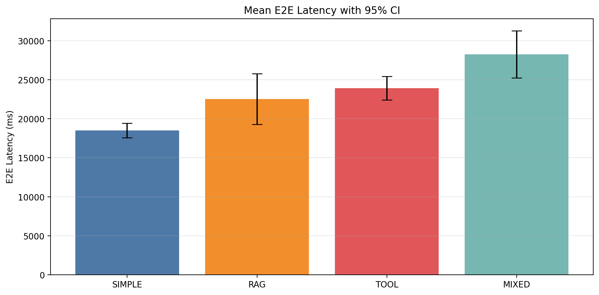

# Evaluation Report: Daraz AI Assistant (Assignment 5)
**Date**: May 5, 2026  
**Source**: `eval_results.json` generated by `run_evals.py`  
**Subject**: CS 4063 - Natural Language Processing  

## 1. Executive Summary
The current evaluation snapshot shows moderate correctness and slow but stable local performance. RAG precision is 54.8% (17/31) and tool accuracy is 62.5% (5/8). The main reason for the false negatives is not complete model failure, but a mix of phrasing mismatch, over-specific or over-generic answers, and a small number of routing/instrumentation issues in the tool path.

## 2. System Configuration
- **OS**: Linux
- **RAM**: 14.85 GB
- **Python**: 3.14.4
- **Judge**: Qwen 2.5-3B-Instruct inside Docker with a neutral judge prompt

## 3. Correctness Summary
| Category | Metric | Result | Notes |
|----------|--------|--------|-------|
| **RAG** | Precision | 54.84% (17/31) | 14 false negatives in the saved snapshot |
| **Tools** | Accuracy | 62.50% (5/8) | 3 tool cases failed in the saved snapshot |
| **Overall** | Snapshot quality | Mixed | Answers are often semantically close, but not always aligned with the expected target text |

## 4. False Negative Analysis

### 4.1 RAG False Negatives
The following representative failures explain why a response that looks reasonable still got marked wrong:

| Question | Expected | Actual behavior | Why it failed |
|----------|----------|-----------------|---------------|
| Does Daraz deliver to rural areas? | "Yes, Daraz delivers nationwide across Pakistan." | Talks about rural delivery and extra lead time | The answer is related, but it does not state the expected nationwide wording clearly enough. |
| What are the shipping charges for Karachi? | "Shipping depends on weight and seller location." | Gives a fixed price (150 PKR) | This is too specific and does not match the expected policy-style answer. |
| What is Daraz Mall? | "A premium channel for 100% authentic brands." | Describes it as an online marketplace with a money-back guarantee | Semantically close, but the answer does not match the expected emphasis. |
| What is the warranty policy? | "Varies by brand and seller, check product description." | Talks about refund/return conditions | This is off-target: warranty and refunds are not the same policy. |
| How do I rate a seller? | "Go to My Orders and click Review." | Mentions product page and seller name | The action is similar, but the navigation path differs from the annotation. |
| Can I cancel my order after shipping? | "No, you must refuse delivery or return it later." | Talks about contacting support and eligibility | The answer avoids the explicit negative expected by the rubric. |
| What is a Verified User review? | "A review from someone who actually bought the item." | Says the policy does not define it | This is a direct mismatch with the expected ground truth. |

### 4.2 Root Causes
1. **Paraphrase sensitivity**: The scorer rewards overlapping keywords, so correct paraphrases can still fail when the wording differs.
2. **Retrieval mismatch**: A few answers are grounded in related context but not the annotated document target.
3. **Policy-template mismatch**: Several expected answers are short and policy-like, while the model produces a longer explanatory answer.

### 4.3 Tool False Negatives
In the saved snapshot, the failed tool cases are the CRM prompts. CRM is a special case because it is part of user context/memory handling. If the backend does not emit an explicit CRM marker, the evaluator cannot count it as a passed tool call even if the assistant internally updates profile state.

## 5. Performance Benchmarks
Latency was measured over 5 trials per scenario.

| Scenario | Mean E2E (ms) | Median (ms) | P90 (ms) | TTFT (ms) | ITL (ms) | 95% CI |
|----------|---------------|-------------|----------|-----------|----------|--------|
| Simple | 18,516.6 | 18,298.5 | 20,368.0 | 16,260.2 | 66.0 | ±935.4 |
| RAG Only | 22,530.7 | 21,446.9 | 28,594.3 | 18,091.0 | 62.5 | ±3,243.6 |
| Tool Only | 23,950.6 | 23,117.0 | 26,439.9 | 21,775.3 | 72.9 | ±1,510.6 |
| Mixed (RAG+Tool) | 28,278.9 | 26,708.6 | 33,530.5 | 23,134.2 | 64.8 | ±3,014.5 |

### Performance Interpretation
- TTFT is the main bottleneck: the assistant takes roughly 16-23 seconds to emit the first token on local hardware.
- ITL stays relatively stable, so token generation itself is consistent once the model is streaming.
- Mixed turns are the slowest, which is expected because retrieval plus tool routing adds prompt construction overhead.

## 6. Throughput
- **Measured throughput**: 0.049 turns/second
- **Duration**: 304.88 seconds
- **Interpretation**: This is adequate for a small local benchmark, but it is not interactive-grade.

## 7. Qualitative Notes
**Strengths**
- The system usually grounds answers in the knowledge base when the retrieval path is correct.
- Tool routing is visible and measurable through the websocket stream.
- The dashboard can now show turn-by-turn progress and tool state.

**Weaknesses**
- RAG precision is still limited by phrasing mismatch and retrieval quality.
- CRM evaluation is sensitive to whether the backend emits an explicit CRM marker.
- The current benchmark does not include a true multi-concurrency latency sweep, so a concurrency-vs-latency curve cannot be derived from this snapshot alone.

**Next Improvements**
1. Add a cross-encoder reranker after retrieval.
2. Tighten answer validation for policy-style questions.
3. Instrument CRM explicitly if it must be graded as a tool.
4. Run a multi-concurrency benchmark to produce a real concurrency-vs-latency curve.

## 8. Generated Artifacts
- `eval_results.json`: raw saved benchmark snapshot.
- `plots/correctness_summary.png`: correctness overview.
- `plots/latency_boxplot.png`: latency distribution by scenario.
- `plots/latency_means_ci.png`: mean latency with confidence intervals.
